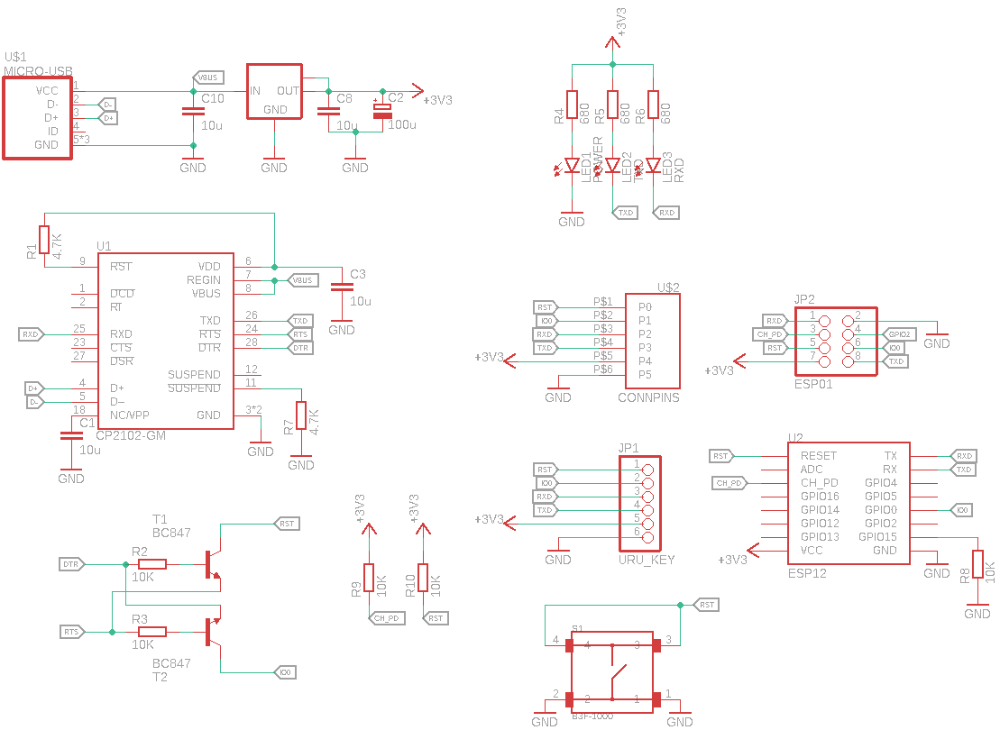
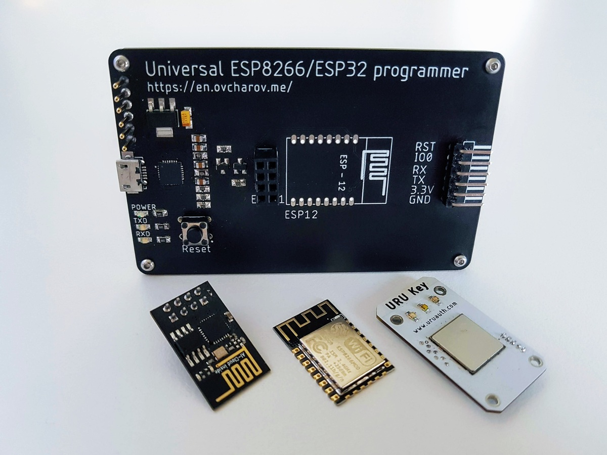

# Universal programmer for ESP8266/ESP32

The repository contains Eagle CAD project for building programming device for ESP8266/ESP32 microcontrollers.

* Support for popular ESP-01 and ESP-12 modules
* Boot/Reset circuitry for automatic flashing
* Separate +3.3V power line

More info in my blog [https://en.ovcharov.me/2020/09/19/universal-esp8266-esp32-programmer/](https://en.ovcharov.me/2020/09/19/universal-esp8266-esp32-programmer/).
